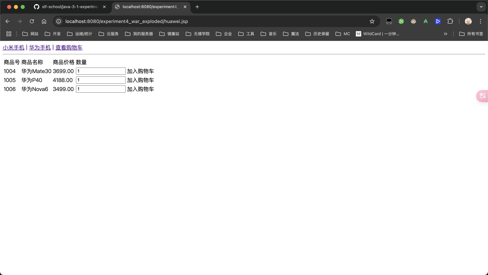
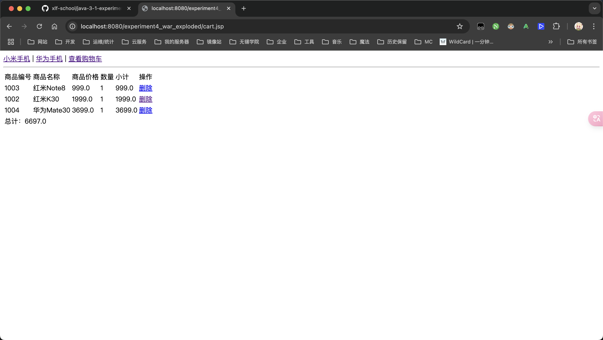
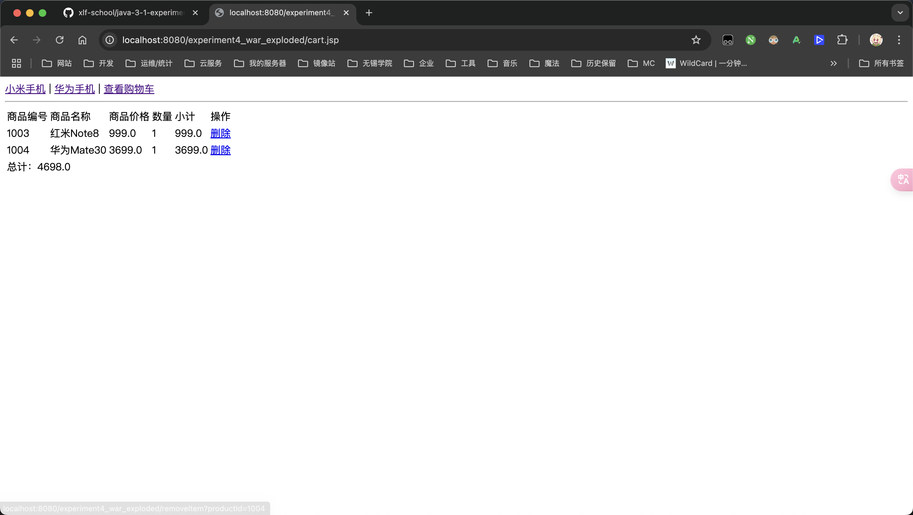
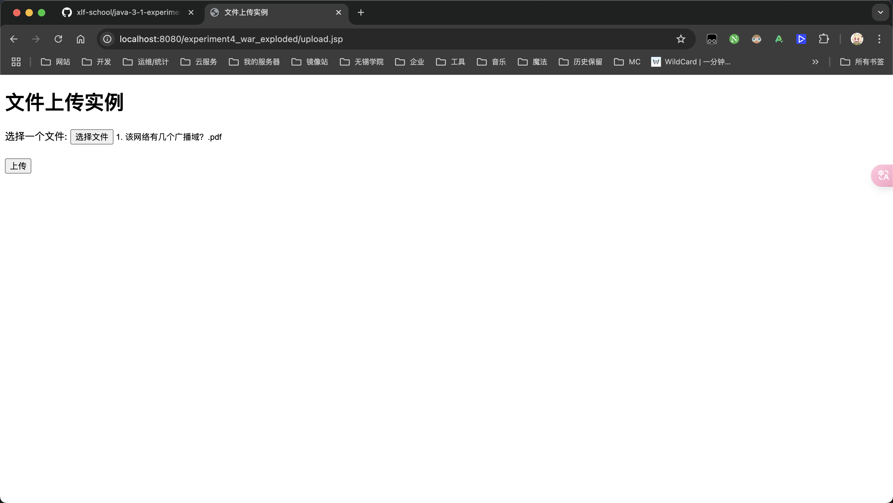
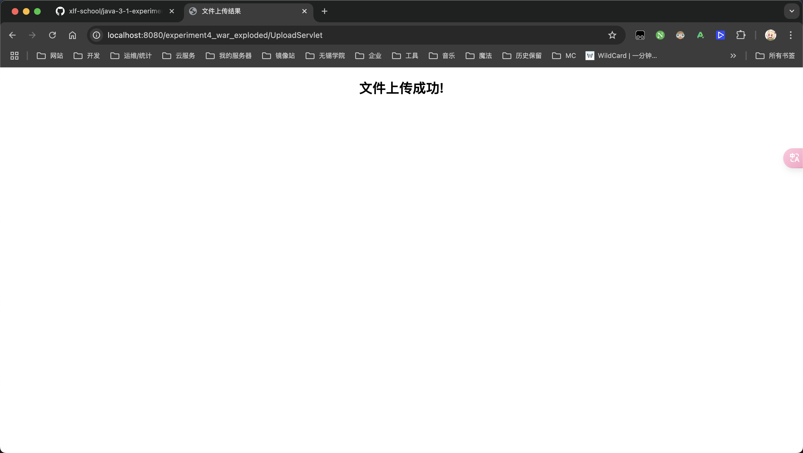
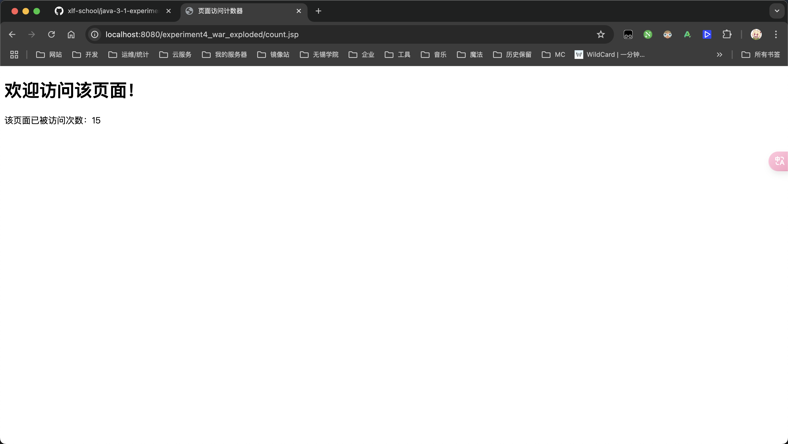

# 第四次实验

## 实验目的

1. JSP 文件上传功能的实现。
2. 在JSP及Servlet中引入JavaBean对象，设置与读取JavaBean属性的方法，以及讨论JavaBean对象的范围。
3. JSP计数功能。


## 实验内容

### 完成教材【例6-3】利用JavaBean开发简易购物车的示例

> 简易购物车的要求是：网站可以购买不同品牌的手机商品，每个品牌的页面中显示不同型号手机的名称和价格，在商品后面可以选择购买的数量，并显示购买的超链接，单击超链接，可以将商品加入用户的购物车中。在不同的页面下，可以自由挑选商品加入购物车，最终显示购物车内手机商品的数量，每种型号手机的个数、小计价格以及整个购物车商品的价格。

#### 源代码

```java
package com.xlf.school.experiment4;

import com.xlf.school.experiment4.bean.Goods;
import javax.servlet.ServletException;
import javax.servlet.annotation.WebServlet;
import javax.servlet.http.HttpServlet;
import javax.servlet.http.HttpServletRequest;
import javax.servlet.http.HttpServletResponse;
import javax.servlet.http.HttpSession;

import java.io.IOException;

/**
 * 添加购物车 Servlet
 * <p>
 * 用于处理添加购物车请求
 *
 * @author xiao_lfeng
 * @version v1.0.0
 * @since v1.0.0
 */
@WebServlet(name = "AddCartServlet", urlPatterns = "/AddCartServlet")
public class AddCartServlet extends HttpServlet {
    @Override
    protected void doGet(HttpServletRequest request, HttpServletResponse response)
            throws ServletException, IOException {
        response.setCharacterEncoding("UTF-8");
        response.setHeader("Content-type", "text/html; charset=UTF-8");

        String gid = request.getParameter("gid");
        String gcount = request.getParameter("gcount");

        if (gid != null && gcount != null) {
            Goods goods;
            GoodsDao goodsDao = new GoodsDao();

            goods = goodsDao.setGoods(Integer.parseInt(gid));
            goods.setGcount(Integer.parseInt(gcount));

            HttpSession session = request.getSession();
            Cart cart = (Cart) session.getAttribute("cart");

            if (cart != null) {
                cart.addGoods(goods);
            } else {
                cart = new Cart();
                cart.addGoods(goods);
            }

            session.setAttribute("cart", cart);
            response.getWriter().println("添加成功！");
            response.getWriter().println("<a href='cart.jsp'>查看购物车</a>");
            response.getWriter().println("<a href='javascript:history.back(-1)'>返回上一页</a>");
        } else {
            response.getWriter().println("参数不正确");
            response.getWriter().println("<a href='javascript:history.back(-1)'>返回上一页</a>");
        }
    }
}
```

```java
package com.xlf.school.experiment4;

import com.xlf.school.experiment4.bean.Goods;

import java.io.Serializable;
import java.util.ArrayList;

/**
 * 购物车类
 * <p>
 * 用于存储用户购物车信息
 *
 * @author xiao_lfeng
 * @version v1.0.0
 * @since v1.0.0
 */
public class Cart implements Serializable {
    private static final long serialVersionUID = 44256950914898900L;
    private ArrayList<Goods> goodslist = new ArrayList<>();

    public ArrayList<Goods> getGoodslist() {
        return goodslist;
    }

    public void setGoodslist(ArrayList<Goods> goodslist) {
        this.goodslist = goodslist;
    }

    public int getGcount() {
        int count = 0;
        for (Goods g : goodslist) {
            count += g.getGcount();
        }
        return count;
    }

    public double getTotal() {
        double sum = 0;
        for (Goods g : goodslist) {
            sum += g.getGprice() * g.getGcount();
        }
        return sum;
    }

    public int check(int gid) {
        for (int i = 0; i < goodslist.size(); i++) {
            if (goodslist.get(i).getGid() == gid) {
                return i;
            }
        }
        return -1;
    }

    public void addGoods(Goods goods) {
        int index = check(goods.getGid());
        if (index == -1) {
            goodslist.add(goods);
        } else {
            Goods g = goodslist.get(index);
            g.setGcount(g.getGcount() + goods.getGcount());
        }
    }

    public void removeItem(int gid) {
        goodslist.removeIf(goods -> goods.getGid() == gid);
    }
}
```

```java
package com.xlf.school.experiment4;


import com.xlf.school.experiment4.bean.Goods;

/**
 * 商品信息 Dao
 * <p>
 * 用于获取商品信息
 *
 * @version v1.0.0
 * @since v1.0.0
 * @author xiao_lfeng
 */
public class GoodsDao {
    public Goods setGoods(int gid) {
        Goods goods = new Goods();

        switch (gid) {
            case 1001:
                goods.setGid(1001);
                goods.setGname("小米10");
                goods.setGprice(3999.00);
                break;
            case 1002:
                goods.setGid(1002);
                goods.setGname("红米K30");
                goods.setGprice(1999.00);
                break;
            case 1003:
                goods.setGid(1003);
                goods.setGname("红米Note8");
                goods.setGprice(999.00);
                break;
            case 1004:
                goods.setGid(1004);
                goods.setGname("华为Mate30");
                goods.setGprice(3699.00);
                break;
            case 1005:
                goods.setGid(1005);
                goods.setGname("华为P40");
                goods.setGprice(4188.00);
                break;
            case 1006:
                goods.setGid(1006);
                goods.setGname("华为Nova6");
                goods.setGprice(3499.00);
                break;
            default:
                // 可以添加默认处理
                break;
        }

        return goods;
    }
}
```

```javascript
var links = document.getElementsByClassName("link");
for (var i = 0; i < links.length; i++) {
    links[i].onclick = function() {
        var gid = this.id;
        var num = document.getElementsByName(gid)[0].value;
        window.location.href = "AddCartServlet?gid=" + gid + "&gcount=" + num;
    };
}
```

```jsp
<%@ page language="java" contentType="text/html; charset=UTF-8" pageEncoding="UTF-8"%>
<%@ include file="header.jsp" %>
<%@ page import="com.xlf.school.experiment4.Cart, com.xlf.school.experiment4.bean.Goods, java.util.ArrayList" %>
<jsp:useBean id="cart" class="com.xlf.school.experiment4.Cart" scope="session"/>
<%
  if (cart == null || cart.getGoodslist().size() == 0) {
%>
<p>您的购物车空空如也...</p>
<%
} else {
  ArrayList<Goods> goodslist = cart.getGoodslist();
  double total = cart.getTotal();
%>
<table>
  <tr>
    <td>商品编号</td>
    <td>商品名称</td>
    <td>商品价格</td>
    <td>数量</td>
    <td>小计</td>
    <td>操作</td>
  </tr>
  <%
    for (Goods goods : goodslist) {
  %>
  <tr>
    <td><%= goods.getGid() %></td>
    <td><%= goods.getGname() %></td>
    <td><%= goods.getGprice() %></td>
    <td><%= goods.getGcount() %></td>
    <td><%= goods.getGprice() * goods.getGcount() %></td>
    <td><a href="removeItem?productId=<%= goods.getGid() %>">删除</a></td>
  </tr>
  <% } %>
  <tr>
    <td colspan="6">总计：<%= total %></td>
  </tr>
</table>
<% } %>
```

```jsp
<%@ page language="java" contentType="text/html; charset=UTF-8" pageEncoding="UTF-8"%>
<a href="xiaomi.jsp">小米手机</a> | <a href="huawei.jsp">华为手机</a> | <a href="cart.jsp">查看购物车</a>
<hr>
```

```jsp
<%@ page language="java" contentType="text/html; charset=UTF-8" pageEncoding="UTF-8"%>
<%@ include file="header.jsp" %>
<table>
  <tr><td>商品号</td><td>商品名称</td><td>商品价格</td><td>数量</td></tr>
  <tr>
    <td>1004</td><td>华为Mate30</td><td>3699.00</td>
    <td><input type="number" name="1004" min="1" value="1" size="5"/></td>
    <td><a class="link" id="1004">加入购物车</a></td>
  </tr>
  <tr>
    <td>1005</td><td>华为P40</td><td>4188.00</td>
    <td><input type="number" name="1005" min="1" value="1" size="5"/></td>
    <td><a class="link" id="1005">加入购物车</a></td>
  </tr>
  <tr>
    <td>1006</td><td>华为Nova6</td><td>3499.00</td>
    <td><input type="number" name="1006" min="1" value="1" size="5"/></td>
    <td><a class="link" id="1006">加入购物车</a></td>
  </tr>
</table>
<script src="addcart.js"></script>
```

```jsp
<%@ page language="java" contentType="text/html; charset=UTF-8" pageEncoding="UTF-8"%>
<%@ include file="header.jsp" %>
<table>
  <tr><td>商品号</td><td>商品名称</td><td>商品价格</td><td>数量</td></tr>
  <tr>
    <td>1001</td><td>小米10</td><td>3999.00</td>
    <td><input type="number" name="1001" min="1" value="1" size="5"/></td>
    <td><a class="link" id="1001">加入购物车</a></td>
  </tr>
  <tr>
    <td>1002</td><td>红米K30</td><td>1999.00</td>
    <td><input type="number" name="1002" min="1" value="1" size="5"/></td>
    <td><a class="link" id="1002">加入购物车</a></td>
  </tr>
  <tr>
    <td>1003</td><td>红米Note8</td><td>999.00</td>
    <td><input type="number" name="1003" min="1" value="1" size="5"/></td>
    <td><a class="link" id="1003">加入购物车</a></td>
  </tr>
</table>
<script src="addcart.js"></script>
```


#### 截图




### 上述内容再添加

> 在6.3节简易购物车的cart.jsp中每个商品后添加删除的超链接，单击后，能够将该商品从购物车中移出。思路：在Cart.Java中增加一个删除商品的方法，然后编写一个处理删除请求的Servlet，调用Cart对象的删除商品方法。

#### 源代码

```java
package com.xlf.school.experiment4;

import javax.servlet.ServletException;
import javax.servlet.annotation.WebServlet;
import javax.servlet.http.HttpServlet;
import javax.servlet.http.HttpServletRequest;
import javax.servlet.http.HttpServletResponse;
import javax.servlet.http.HttpSession;
import java.io.IOException;

@WebServlet("/removeItem")
public class RemoveItemServlet extends HttpServlet {
    @Override
    protected void doGet(HttpServletRequest request, HttpServletResponse response) throws ServletException, IOException {
        String productId = request.getParameter("productId");
        HttpSession session = request.getSession();
        Cart cart = (Cart) session.getAttribute("cart");

        if (cart != null && productId != null) {
            int gid = Integer.parseInt(productId);
            cart.removeItem(gid);
        }

        // 重定向回购物车页面
        response.sendRedirect("cart.jsp");
    }
}
```

```jsp
<%@ page language="java" contentType="text/html; charset=UTF-8" pageEncoding="UTF-8"%>
<%@ include file="header.jsp" %>
<%@ page import="com.xlf.school.experiment4.Cart, com.xlf.school.experiment4.bean.Goods, java.util.ArrayList" %>
<jsp:useBean id="cart" class="com.xlf.school.experiment4.Cart" scope="session"/>
<%
  if (cart == null || cart.getGoodslist().size() == 0) {
%>
<p>您的购物车空空如也...</p>
<%
} else {
  ArrayList<Goods> goodslist = cart.getGoodslist();
  double total = cart.getTotal();
%>
<table>
  <tr>
    <td>商品编号</td>
    <td>商品名称</td>
    <td>商品价格</td>
    <td>数量</td>
    <td>小计</td>
    <td>操作</td>
  </tr>
  <%
    for (Goods goods : goodslist) {
  %>
  <tr>
    <td><%= goods.getGid() %></td>
    <td><%= goods.getGname() %></td>
    <td><%= goods.getGprice() %></td>
    <td><%= goods.getGcount() %></td>
    <td><%= goods.getGprice() * goods.getGcount() %></td>
    <td><a href="removeItem?productId=<%= goods.getGid() %>">删除</a></td>
  </tr>
  <% } %>
  <tr>
    <td colspan="6">总计：<%= total %></td>
  </tr>
</table>
<% } %>
```


#### 截图






### 文件的上传

> JSP 可以与 HTML form 标签一起使用，来允许用户上传文件到服务器。上传的文件可以是文本文件或图像文件或任何文档。使用 Servlet 来处理文件上传

#### 源代码

```java
package com.xlf.school.experiment4;

import org.apache.commons.fileupload.FileItem;
import org.apache.commons.fileupload.disk.DiskFileItemFactory;
import org.apache.commons.fileupload.servlet.ServletFileUpload;

import javax.servlet.ServletException;
import javax.servlet.annotation.WebServlet;
import javax.servlet.http.HttpServlet;
import javax.servlet.http.HttpServletRequest;
import javax.servlet.http.HttpServletResponse;
import java.io.File;
import java.io.IOException;
import java.io.PrintWriter;
import java.util.List;


/**
 * 上传文件 Servlet
 * <p>
 * 用于处理上传文件请求
 *
 * @version v1.0.0
 * @since v1.0.0
 * @author xiao_lfeng
 */
@WebServlet("/UploadServlet")
public class UploadServlet extends HttpServlet {
    private static final long serialVersionUID = 1L;

    // 上传文件存储目录
    private static final String UPLOAD_DIRECTORY = "upload";

    // 上传配置
    private static final int MEMORY_THRESHOLD = 1024 * 1024 * 3;
    private static final int MAX_FILE_SIZE = 1024 * 1024 * 40;
    private static final int MAX_REQUEST_SIZE = 1024 * 1024 * 50;

    /**
     * 上传数据及保存文件
     */
    @Override
    protected void doPost(HttpServletRequest request,
                          HttpServletResponse response) throws ServletException, IOException {
        // 检测是否为多媒
        if(!ServletFileUpload.isMultipartContent(request)) {
            //如果不是则停止
            PrintWriter writer = response.getWriter();
            writer.println("ERROR：表单必须包含enctype=multipart/form-data");
            writer.flush();
            return;
        }

        // 配置上传参数
        DiskFileItemFactory factory = new DiskFileItemFactory();
        // 设置内存临界值 - 超过后将产生临时文件并存储于临时目录中
        factory.setSizeThreshold(MEMORY_THRESHOLD);
        // 设置临时存储目录
        factory.setRepository(new File(System.getProperty("java.io.tmpdir")));

        ServletFileUpload upload = new ServletFileUpload(factory);

        // 设置最大文件上传值
        upload.setFileSizeMax(MAX_FILE_SIZE);

        // 设置最大请求值 (包含文件和表单数据)
        upload.setSizeMax(MAX_REQUEST_SIZE);

        // 中文处理
        upload.setHeaderEncoding("UTF-8");

        // 构造临时路径来存储上传的文件
        // 这个路径相对当前应用的目录
        String uploadPath = getServletContext().getRealPath("/") + File.separator + UPLOAD_DIRECTORY;


        // 如果目录不存在则创建
        File uploadDir = new File(uploadPath);
        if (!uploadDir.exists()) {
            uploadDir.mkdir();
        }

        try {
            // 解析请求的内容提取文件数据
            List<FileItem> formItems = upload.parseRequest(request);

            if (formItems != null && formItems.size() > 0) {
                // 迭代表单数据
                for (FileItem item : formItems) {
                    // 处理不在表单中的字段
                    if (!item.isFormField()) {
                        String fileName = new File(item.getName()).getName();
                        String filePath = uploadPath + File.separator + fileName;
                        File storeFile = new File(filePath);
                        // 在控制台输出文件的上传路径
                        System.out.println(filePath);
                        // 保存文件到硬盘
                        item.write(storeFile);
                        request.setAttribute("message",
                                "文件上传成功!");
                    }
                }
            }
        } catch (Exception ex) {
            request.setAttribute("message",
                    "错误信息: " + ex.getMessage());
        }
        // 跳转到 message.jsp
        getServletContext().getRequestDispatcher("/message.jsp").forward(
                request, response);
    }
}
```

```jsp
<%@ page contentType="text/html; charset=UTF-8"
         pageEncoding="UTF-8" %>
<!DOCTYPE html PUBLIC "-//W3C//DTD HTML 4.01 Transitional//EN"
"http://www.w3.org/TR/html4/loose.dtd">
<html>
<head>
    <meta http-equiv="Content-Type" content="text/html; charset=UTF-8">
    <title>文件上传实例</title>
</head>
<body>
<h1>文件上传实例</h1>
<form method="post" action="${pageContext.request.contextPath}/UploadServlet" enctype="multipart/form-data">
    选择一个文件:
    <input type="file" name="uploadFile"/>
    <br/><br/>
    <input type="submit" value="上传"/>
</form>
</body>
</html>
```

```jsp
<%@ page contentType="text/html; charset=UTF-8"
         pageEncoding="UTF-8"%>
<!DOCTYPE html PUBLIC "-//W3C//DTD HTML 4.01 Transitional//EN"
"http://www.w3.org/TR/html4/loose.dtd">
<html>
<head>
    <meta http-equiv="Content-Type" content="text/html; charset=UTF-8">
    <title>文件上传结果</title>
</head>
<body>
<center>
    <h2>${message}</h2>
</center>
</body>
</html>
```


#### 截图






### JSP 点击量统计

> 有时候我们需要知道某个页面被访问的次数，这时我们就需要在页面上添加页面统计器，页面访问的统计一般在用户第一次载入时累加该页面的访问数上。
>
> 要实现一个计数器，您可以利用应用程序隐式对象和相关方法getAttribute()和setAttribute()来实现。
>
> 这个对象表示JSP页面的整个生命周期中。当JSP页面初始化时创建此对象，当JSP页面调用jspDestroy()时删除该对象。
>
> 以下是在应用中创建变量的语法：
>
> application.setAttribute(String Key, Object Value);
>
> 您可以使用上述方法来设置一个计数器变量及更新该变量的值。读取该变量的方法如下：
>
> application.getAttribute(String Key);
>
> 在页面每次被访问时，你可以读取计数器的当前值，并递增1，然后重新设置，在下一个用户访问时就将新的值显示在页面上。

#### 源代码

```jsp
<%@ page contentType="text/html; charset=UTF-8" pageEncoding="UTF-8" %>
<%@ page import="java.io.*" %>
<!DOCTYPE html>
<html lang="en">
<head>
    <meta charset="UTF-8">
    <title>页面访问计数器</title>
</head>
<body>

<%
    String counterKey = "pageVisitCounter";

    // 检查 application 对象中是否已有计数器值
    Integer counter = (Integer) application.getAttribute(counterKey);
    if (counter == null) {
        counter = 0;
    }

    counter++;

    application.setAttribute(counterKey, counter);
%>

<h1>欢迎访问该页面！</h1>
<p>该页面已被访问次数：<%= counter %>
</p>

</body>
</html>
```


#### 截图


